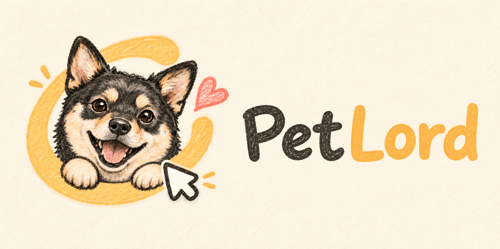
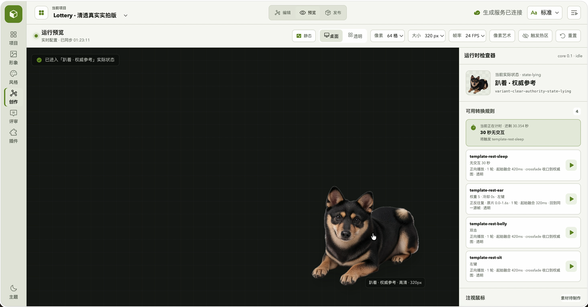
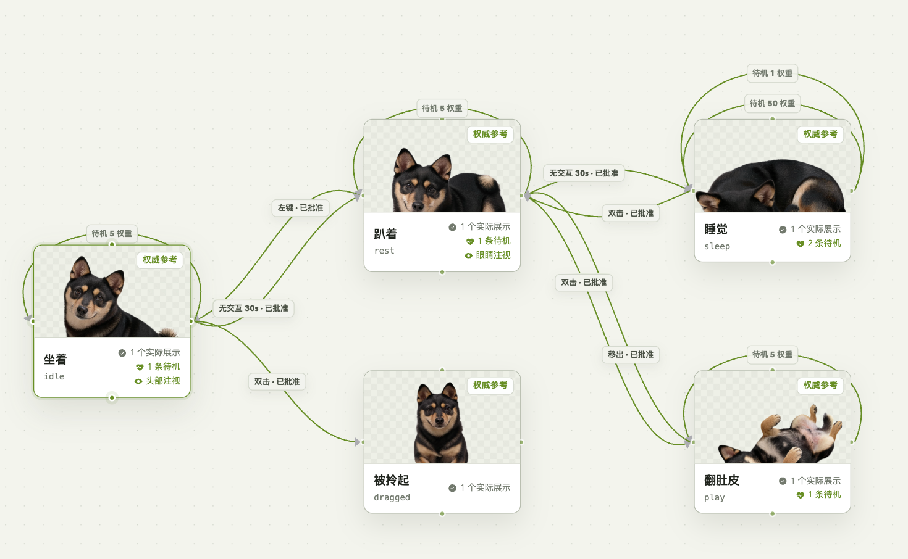

<strong>English</strong> · <a href="docs/README.zh-CN.md">简体中文</a>

<h1 align="center">PetLord</h1>

  

  
  
  
  
  
  

Create interactive desktop companions at scale with reusable identity, style, and motion templates.

## What PetLord provides

PetLord provides two composable, reusable creation systems:

- **State and transition model**: control which action a desktop companion performs and when.
- **Style and identity templates**: reuse visual styles and character identities to create desktop companions in batches.

The Creator and Desktop Client are separate: preview changes in real time to create and validate quickly, then run finished companions independently in the Desktop Client.

**[▶ Watch the full demo (35 seconds)](assets/petlord-demo.mp4)**

## State and transition model

Bind actions to clicks, double-clicks, hover, drag, idle time, timers, and other conditions to control when a desktop companion changes state and which transition it plays.

