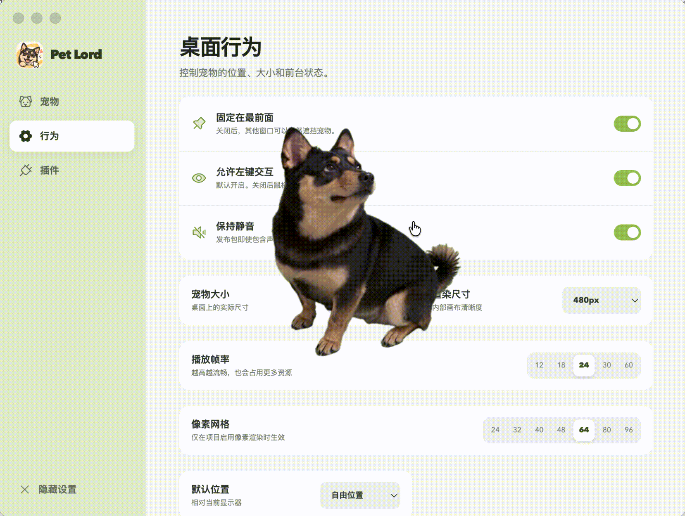

<p align="center"><a href="../README.md">English</a> · <strong>简体中文</strong></p>

<h1 align="center">PetLord</h1>

<p align="center">
  
</p>

<p align="center">
  
  
  
  <a href="../LICENSE"></a>
</p>

<p align="center">用可复用的形象、风格与动作模板，批量创作可交互的桌面搭子。</p>

## PetLord 提供什么

PetLord 提供两套可组合、可复用的创作能力：

- **状态及过渡动作模型**：控制桌面搭子在什么情况下展示什么动作。
- **风格模板与形象模板**：复用风格和角色形象，支持批量创作桌面搭子。

创作平台与桌面客户端相互独立：在创作平台实时预览，快速创作、快速验证；完成后的宠物在桌面客户端独立运行。




## 状态及过渡动作模型

为点击、双击、悬停、拖拽、空闲和定时等条件配置动作，决定桌面搭子何时切换状态、播放什么过渡动作。


## 本地运行

PetLord 需要 Node.js 22.5 或更高版本。项目启动不需要预先配置 API Token。

```bash
git clone https://github.com/Lajunkai929/petlord.git
cd petlord
npm install
npm run dev
```

打开 `http://localhost:4310`，在状态图工具栏进入「模型与 Provider」。图片和视频 Provider 独立配置；凭据只保存在本机 `runtime-data/petlord.sqlite`，设置接口不会把凭据返回浏览器。每种能力都可以保存多个 Provider，并按项目选择。

提交改动前运行 `npm run check`，它会依次执行类型检查、测试和所有工作区的生产构建。
